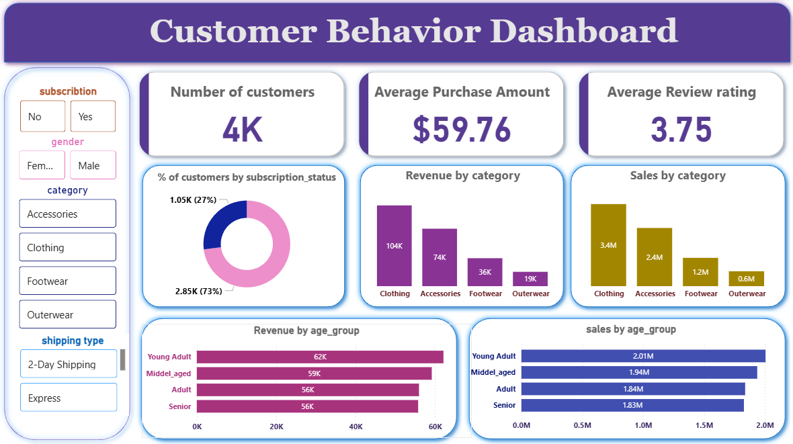

# 🛍️ Customer Shopping Behavior Analysis

<div align="center">

<!-- Dashboard screenshot -->





**Uncover deep insights into customer spending patterns, segments, and product performance using Python, SQL, and Power BI.**

</div>

## 📖 Overview

This repository presents a comprehensive analysis of customer shopping behavior, designed to help businesses understand their customers better and optimize their strategies. Leveraging Python for data manipulation and analysis, SQL for structured data querying, and Power BI for interactive visualizations, this project dives into transactional data to extract actionable insights.

The analysis focuses on identifying key spending patterns, segmenting customers based on their behavior, evaluating product performance, and deriving insights related to customer subscriptions. The goal is to provide a clear, data-driven understanding that can inform marketing campaigns, product development, and overall business strategy.

## ✨ Features

- **🛒 Spending Pattern Identification:** Analyze purchase frequency, average transaction value, and preferred payment methods.
- **👥 Customer Segmentation:** Group customers into distinct segments based on their shopping behavior for targeted marketing.
- **📈 Product Performance Evaluation:** Identify best-selling products, seasonal trends, and product affinities.
- **📧 Subscription Insights:** Investigate trends and patterns related to customer subscriptions.
- **📊 Data-Driven Reporting:** Generate comprehensive reports and interactive dashboards to visualize key metrics and findings.
- **🧹 Data Cleaning & Preprocessing:** Handle missing values, outliers, and prepare data for analysis.
- **🔍 Exploratory Data Analysis (EDA):** In-depth exploration of data distributions and relationships.

## 🖥️ Key Deliverables

- **[Custmor_Sopping_Behavior_analysis.ipynb](Custmor_Sopping_Behavior_analysis.ipynb):** Jupyter Notebook with full analysis workflow.
- **[Project_report.pdf](Project_report.pdf):** Detailed PDF report summarizing objectives, methodology, and insights.
- **[Images/](Images/):** Directory with visualizations, charts, and plots generated during analysis.

## 🛠️ Tech Stack

**Programming & Analysis:**


**Data Storage & Querying:**


**Reporting & Visualization:**


## 📊 Data Sources

- **[customer_shopping_behavior.csv](customer_shopping_behavior.csv):** Raw transactional data.
- **[customer_behavior.sql](customer_behavior.sql):** SQL script defining schema and queries.

## 🚀 Quick Start

### Prerequisites

- Python 3.x
- Jupyter Notebook / JupyterLab
- pip
- SQL database client/server (PostgreSQL, MySQL, SQLite)

### Installation

```bash
# Clone repository
git clone https://github.com/idabella/customer_behavior_analysis.git
cd customer_behavior_analysis

# Create virtual environment
python -m venv venv
source venv/bin/activate  # Windows: venv\Scripts\activate

# Install dependencies
pip install pandas numpy matplotlib seaborn jupyter
